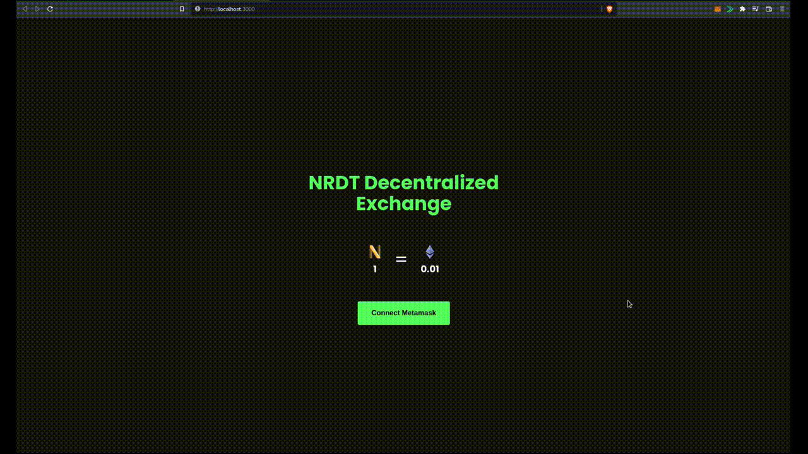

# [NRDT Decentralized Exchange](https://nrdt-token-exchange.web.app/ "NRDT Decentralized Exchange")

A decentralized exchange and an ERC-20 token running on top of the Ethereum blockchain (Ropsten Test Net).

  

## [Access it here](https://nrdt-token-exchange.web.app/ "Homepage")

### What was used on the project

- React
- Typescript
- Solidity
- Web3
- Github Action (Firebase deploy)
- Firebase Hosting
- Chai
